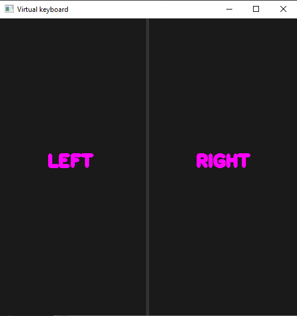
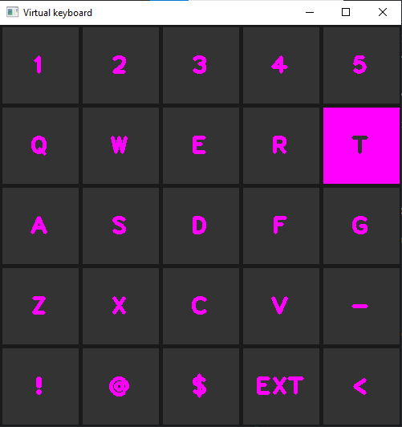

# EyeSpeech
>

## Tutorial Video:
---

`LINK` : https://youtu.be/y6GKnqCyevE
>
## Installation of library:
---

**Before runnning this project, some important library that must be install in system are:**

    1. dlib
    2. opencv
    3. gtts
    4. pyglet
    5. numpy

### 1. dlib
***To install on jetson nano kit, follow below given link of youtube***

`Link :`  https://youtu.be/yOdVnQuhfeI

### 2. opencv
**To install on jetson nano kit, follow below given code**

`Code :`  *pip3 install opencv-contrib-python*

### 3. gtts
**To install on jetson nano kit, follow below given code**

`Code :`  *pip3 install gtts*

### 4. pyglet
**To install on jetson nano kit, follow below given code**

`Code :`  *pip install pyglet*

### 5. numpy
**To install on jetson nano kit, follow below given code**

`Code :`  *pip install numpy*

>

## Camera setup (VideoCapture):
---

**There are 3 ways to setup the camera**

1. CSI Camera

2. Phone Camera

3. External Camera

### 1. CSI Camera
**To use CSI Camera use following  *code*:**

    def gstreamer_pipeline(
        capture_width=500,
        capture_height=500,
        display_width=500,
        display_height=500,
        framerate=30,
        flip_method=0,
    ):
        return (
            "nvarguscamerasrc ! "
            "video/x-raw(memory:NVMM), "
            "width=(int)%d, height=(int)%d, "
            "format=(string)NV12, framerate=(fraction)%d/1 ! "
            "nvvidconv flip-method=%d ! "
            "video/x-raw, width=(int)%d, height=(int)%d, format=(string)BGRx ! "
            "videoconvert ! "
            "video/x-raw, format=(string)BGR ! appsink"
            % (
                capture_width,
                capture_height,
                framerate,
                flip_method,
                display_width,
                display_height,
            )
    )

#### Pass the following parameter in cv2.VideoCapture()
    cap = cv2.VideoCapture(gstreamer_pipeline(flip_method=0), cv2.CAP_GSTREAMER) 

### 2. Phone Camera
To use your phone camera as webcam, follow the following steps as per given in the link:

`Link`: 

https://www.geeksforgeeks.org/connect-your-android-phone-camera-to-opencv-python/

### 3. External Camera

To use external USB camera, just change the parameter in the VideCapture() function:

>Pass '1' as parameter to use External USB camera

>Pass '0' as parameter to use Internal camera

Example:
    
    cap = cv2.VideoCapture(1) #for External camera 

    cap = cv2.VideoCapture(0) #for Internal camera

For more information follow below Link:

`Link` : 
https://docs.opencv.org/3.4/d8/dfe/classcv_1_1VideoCapture.html
>

## Keyboard settings:
---

Keyboard is divided into 2 part i.e. 
1. Left
2. Right

### Left keyboard contains following keys:
*To select Left keyboard, move yours Eye ball(see) on `LEFT SIDE`.*

### Right keyboard contains following keys:
*To select Right keyboard, move yours Eye ball(see) on `RIGHT SIDE`.*

>
## Explaination of project:
---
- Detecting the location of `Eye Ball` with the help of opencv library.

- Move `Eye Ball` to `Left Side` to select `Left Keyboard`,Move `Eye Ball` to `Right Side` to select `Right Keyboard`.

- Each key in the keyboard will be light up for one time from first key to last key in a loop.

- Close (*Blink*) your eye for `3 sec` to press that key (*the key which is light up*).

- Pressed key will be Displayed on `BOARD`.

- To exit the program, close (*Blink*) your eye at `Ext` key which is in `Left Keyboard` else press `ENTER` key on the keyboard.

- As the program is closed, `BOARD TEXT` is saved into file & also it is converted into `AUDIO` file.

- AUDIO file will be played for `3 times.`

### NOTE:
**INTERNET CONNECTION IS NEEDED TO RUN THIS PROGRAM BECAUSE `TEXT FILE` IS CONVERTED INTO `AUDIO FILE` IN PRESENCE OF INTERNET CONNECTION.**

>
## Uses:
---
### There can be many uses of this program, some of them are listed below.

- The person whoes whole body, hand, mouth is paralyzed, for them this is usesful.

- The Best example can be `Dr. Stephen Hawking` whoes whole body is paralyzed except cheek then also with the help of cheek he has written many books.

>
## Summary:
***
*There are some limitation of this program but with some improvements, this program can be made best.*

